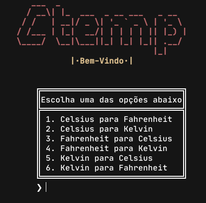

<div align="center">
    <a href="#">
        
     </a>
     
 <h1 align="center">🌡️ Ctemp CLI 🌡️</h1>
     
 </div>
 
 Ctemp CLI é um conversor de escalas termométricas feito em C++ para treinar e desenvolver habilidades.
 Se quiser ajudar, aceito dicas de como melhorar.
 
 ## ❯ Instalação
 ``` shell
 $ git clone https://github.com/yabamiah/ctemp.git
 $ cd ctemp
 $ make install
 ```

 ## ❯ Desinstalar
 ``` shell
 $ cd ctemp
 $ make uninstall
 ```
 ## ❯ Executar
 Só usar este comando após compilar```./ctemp```, e se por acaso não esteja executável, basta rodar```chmod +x ctemp```.
 ### ❯ Ctemp
 
